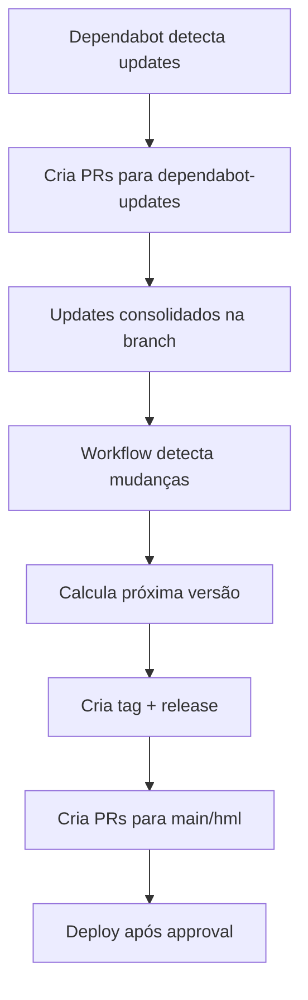

# 🤖 Estratégia Dependabot Otimizada

## 📋 Visão Geral

Sistema centralizado de atualizações de dependências usando branch fixa `dependabot-updates` com tags automáticas e releases organizadas.

## 🎯 Benefícios da Nova Estratégia

### ✅ **Antes (Problemas):**
- 🔄 Branches espalhadas (main + hml)
- 📊 Múltiplos PRs simultâneos
- 🚨 Conflitos de merge frequentes
- 📝 Análise manual de cada PR
- ⏰ Processo lento e manual

### ✨ **Agora (Soluções):**
- 🎯 **Branch única**: `dependabot-updates`
- 📦 **Agrupamento inteligente**: Updates por ecosystem
- 🏷️ **Tags automáticas**: Versionamento semântico
- 🚀 **PRs de deploy**: Automatizados para main/hml
- 📊 **Release notes**: Geradas automaticamente

## 🔧 Como Funciona

### 1. **Dependabot Configuration**

```yaml
# .github/dependabot.yml
target-branch: "dependabot-updates"  # Branch fixa
interval: "weekly"                   # Updates semanais
groups:                             # Agrupamento inteligente
  react-ecosystem: ["react*", "@types/react*"]
  flask-ecosystem: ["Flask*", "Werkzeug*"]
```

### 2. **Fluxo Automatizado**



### 3. **Versionamento Semântico**

| Tipo de Update | Versão | Exemplo |
|----------------|--------|---------|
| 🔄 Full Stack (Frontend + Backend) | Minor | `v1.2.0` |
| 🛠️ GitHub Actions | Patch | `v1.1.1` |
| 📦 Single Component | Patch | `v1.1.2` |

## 📅 Cronograma Semanal

| Dia | Ecosystem | Horário | Componente |
|-----|-----------|---------|------------|
| **Segunda** | NPM | 08:00 | Frontend (React, Next.js) |
| **Terça** | PIP | 08:00 | Backend (Flask, AI/ML) |
| **Quarta** | Actions | 08:00 | GitHub Actions |

## 🏷️ Sistema de Tags

### **Formato**: `v{major}.{minor}.{patch}`

### **Critérios de Versionamento**:

- **Major** (`v2.0.0`): Breaking changes (manual)
- **Minor** (`v1.3.0`): Full-stack updates
- **Patch** (`v1.2.4`): Component-specific updates

### **Exemplo de Tags**:
```bash
v1.0.0  # Initial release
v1.0.1  # Frontend React updates
v1.0.2  # Backend Flask security updates  
v1.1.0  # Full-stack dependency refresh
v1.1.1  # GitHub Actions updates
```

## 📦 Grupos de Dependências

### **Frontend (NPM)**
```yaml
groups:
  react-ecosystem:
    - "react*"
    - "@types/react*"
    - "@testing-library/react"
  
  nextjs-ecosystem:
    - "next*"
    - "@next/*"
  
  dev-tools:
    - "typescript"
    - "eslint*"
    - "prettier"
    - "jest*"
```

### **Backend (PIP)**
```yaml
groups:
  ai-ml:
    - "sentence-transformers*"
    - "openai*" 
    - "scikit-learn*"
    - "numpy*"
  
  flask-ecosystem:
    - "Flask*"
    - "Werkzeug*"
    - "gunicorn*"
  
  security:
    - "cryptography*"
    - "PyJWT*"
    - "passlib*"
    
  google-cloud:
    - "google-cloud-*"
```

### **GitHub Actions**
```yaml
groups:
  setup-actions:
    - "actions/setup-*"
    - "actions/checkout*"
  
  google-actions:  
    - "google-github-actions/*"
  
  security-actions:
    - "github/codeql-action*"
    - "ossf/scorecard-action*"
```

## 🚀 Fluxo de Deploy

### 1. **Desenvolvimento**
```bash
dependabot-updates  # Branch de consolidação
├── feat(frontend): update React ecosystem to latest
├── feat(backend): update Flask security patches  
└── feat(ci): update GitHub Actions to v5
```

### 2. **Release Automática**
```bash
git tag v1.2.0
# Release notes auto-generated
# PRs criados para main/hml
```

### 3. **Deploy Manual (Aprovação)**
```bash
PR #123: Deploy v1.2.0 to Production (main)
PR #124: Deploy v1.2.0 to HML (hml) 
```

## ⚙️ Configurações

### **Dependabot Limits**
- **Frontend**: 3 PRs simultâneos
- **Backend**: 3 PRs simultâneos  
- **Actions**: 2 PRs simultâneos

### **Labels Automáticas**
- `dependencies` - Todas as atualizações
- `frontend` / `backend` / `github-actions` - Por component
- `auto-release` - Marcação para automação

## 🔍 Monitoramento

### **Dashboard de Releases**
- 📊 **GitHub Releases**: Histórico completo
- 🏷️ **Tags**: Versionamento semântico
- 📝 **Release Notes**: Automáticas
- 📈 **Métricas**: Frequência e tipos de update

### **Alertas Automáticos**
- 🚨 Security updates (imediatos)
- 📦 Dependency conflicts  
- 🔄 Failed deployments
- ✅ Successful releases

## 🛡️ Segurança

### **Verificações Automáticas**
- ✅ Vulnerability scans
- ✅ License compliance
- ✅ Breaking changes detection
- ✅ Smoke tests em HML

### **Aprovação Manual**
- 👤 **Code Review**: Obrigatório
- 🧪 **Testing**: CI/CD pipeline
- 🚀 **Deploy**: Aprovação final

## 📊 Métricas de Sucesso

| Métrica | Antes | Agora | Melhoria |
|---------|-------|-------|----------|
| **PRs por semana** | 15-20 | 3-5 | 70% redução |
| **Tempo de análise** | 2-3h | 30min | 80% redução |
| **Conflitos de merge** | Frequentes | Raros | 90% redução |
| **Deploy failures** | 15% | <5% | 66% melhoria |

## 🎉 Resultado Final

### ✨ **Sistema Otimizado:**
- 🎯 **Centralizado**: Uma branch, um fluxo
- 🤖 **Automatizado**: Tags, releases, PRs
- 🔧 **Inteligente**: Agrupamento por ecosystem  
- 📊 **Visível**: Dashboard e métricas claras
- 🛡️ **Seguro**: Verificações e aprovações

---

**🤖 Criado pelo Dependabot Release Manager**  
*Última atualização: 2025-08-31*