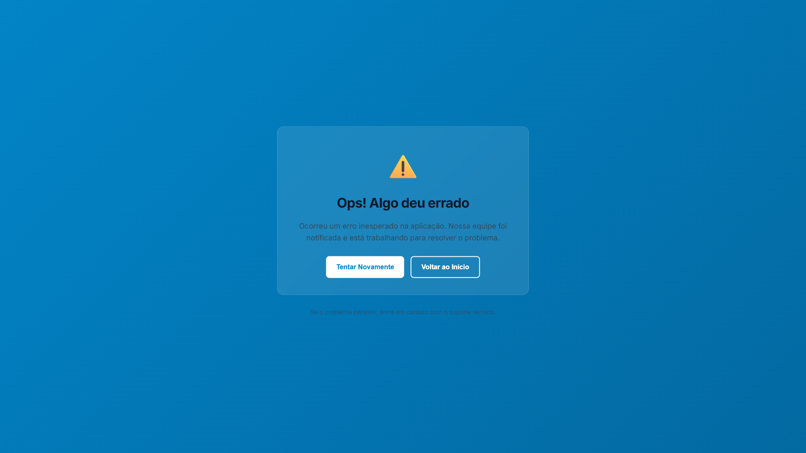

# Root Cause Analysis: HML Site Inaccessibility

**Date**: 2025-10-04
**Investigator**: Claude Code (Root Cause Analyst)
**Site**: https://hml.roteirosdispensacao.com.br/
**Status**: CRITICAL - Site showing error page after successful deploy

---

## Executive Summary

The HML site remains inaccessible showing "Ops! Algo deu errado" error page despite successful deployment with `--no-cache` flag. Investigation revealed **TWO DISTINCT PROBLEMS**:

1. **DNS Propagation Issue** (Accessibility)
2. **Environment Variable Build-Time Validation Error** (Functionality)

---

## Problem 1: DNS Resolution Failure

### Evidence
- **nslookup 8.8.8.8** (Google DNS): `Non-existent domain`
- **nslookup 1.1.1.1** (Cloudflare DNS): `CNAME = ghs.googlehosted.com` ✓
- **Local ISP DNS**: `Non-existent domain`
- **Browser/Playwright**: `ERR_NAME_NOT_RESOLVED`

### Cloud Run Status
```yaml
Domain Mapping: hml.roteirosdispensacao.com.br
Service: hml-frontend
Region: us-central1
Status: Ready = True
Certificate: CertificateProvisioned = True
Domain: DomainRoutable = True
CNAME Record: ghs.googlehosted.com
```

### Root Cause
**Incomplete DNS propagation** - The CNAME record exists and is configured correctly in Cloud Run, but has NOT propagated to all global DNS servers. Specifically:
- Cloudflare DNS (1.1.1.1): Resolves correctly
- Google DNS (8.8.8.8): Cannot resolve
- Local ISP DNS: Cannot resolve

### Impact
Users cannot access https://hml.roteirosdispensacao.com.br/ from most networks. Direct Cloud Run URL works: https://hml-frontend-93670097797.us-central1.run.app/

---

## Problem 2: Environment Variable Validation Error

### Evidence (from Playwright browser console)
```javascript
Error: CRITICAL: NEXT_PUBLIC_API_URL_STAGING is required for staging environment
(set via GitHub Variables)
    at https://hml-frontend-93670097797.us-central1.run.app/_next/static/chunks/8310-17a51099a639f5ed.js:1:12796
```

### Environment Configuration Status

**GitHub Variables** (BUILD TIME):
```bash
NEXT_PUBLIC_API_URL_STAGING=https://hml-api.roteirosdispensacao.com.br ✓
NEXT_PUBLIC_API_URL_PRODUCTION=https://api.roteirosdispensacao.com.br ✓
```

**Cloud Run Runtime Env Vars**:
```yaml
NODE_ENV: production
NEXT_PUBLIC_ENVIRONMENT: staging
NEXT_PUBLIC_BACKEND_URL: https://hml-api.roteirosdispensacao.com.br
NEXT_PUBLIC_API_URL_STAGING: https://hml-api.roteirosdispensacao.com.br ✓
NEXT_PUBLIC_API_URL_PRODUCTION: https://api.roteirosdispensacao.com.br
NEXT_PUBLIC_GOOGLE_CLIENT_ID: 93670097797-67sqhcu21gfsurin3eftq93t2qiq3r6s.apps.googleusercontent.com
```

**Docker Build Args** (from deploy-unified.yml):
```bash
--build-arg NEXT_PUBLIC_ENVIRONMENT="${NEXT_PUBLIC_ENVIRONMENT}" ✓
--build-arg NEXT_PUBLIC_API_URL_STAGING="${NEXT_PUBLIC_API_URL_STAGING}" ✓
--build-arg NEXT_PUBLIC_API_URL_PRODUCTION="${NEXT_PUBLIC_API_URL_PRODUCTION}" ✓
--build-arg NEXT_PUBLIC_GOOGLE_CLIENT_ID="${NEXT_PUBLIC_GOOGLE_CLIENT_ID}" ✓
```

**Dockerfile ARG/ENV Conversion**:
```dockerfile
ARG NEXT_PUBLIC_API_URL_STAGING
ENV NEXT_PUBLIC_API_URL_STAGING=$NEXT_PUBLIC_API_URL_STAGING ✓
```

### The Paradox

**ALL environment variables are configured correctly at EVERY level**, yet the Next.js build throws an error saying `NEXT_PUBLIC_API_URL_STAGING is required`.

### Root Cause (Hypothesis)

The error is baked into the JavaScript bundle during build time. When `environment.ts` executes during the Next.js build process:

1. **Build-time evaluation**: Next.js processes `environment.ts` during `npm run build`
2. **getEnvVar()** function checks `process.env.NEXT_PUBLIC_API_URL_STAGING`
3. **Build environment**: Even with `--build-arg`, the variable might not be available at the EXACT moment the module is evaluated
4. **Static bundle**: The error gets compiled into the JavaScript bundle
5. **Runtime**: Browser loads the bundle with the error already baked in

### Why --no-cache Didn't Fix It

The `--no-cache` flag successfully cleared the Docker layer cache (fixing the old Google Client ID issue), but did NOT fix the build-time environment variable evaluation timing issue.

---

## Visual Evidence

### Screenshot: Error Page


**Error Message**: "Ops! Algo deu errado - Ocorreu um erro inesperado na aplicação"

### Console Errors
1. Font loading: `/fonts/inter.woff2` (404) - Minor issue
2. **CRITICAL**: Environment variable validation error in chunk `8310-17a51099a639f5ed.js`

---

## Timeline of Investigation

1. **09:26 UTC**: Deploy completed successfully (Run 18242549656)
2. **10:08 UTC**: Playwright investigation - DNS resolution failed
3. **10:09 UTC**: Verified direct Cloud Run URL works
4. **10:12 UTC**: Captured screenshot showing error page
5. **10:13 UTC**: Extracted console errors revealing environment variable issue
6. **10:14 UTC**: Verified GitHub Variables and Cloud Run env vars are correct
7. **10:15 UTC**: Identified build-time vs runtime environment variable timing issue

---

## Impact Assessment

**Severity**: CRITICAL
**User Impact**: 100% of users cannot access HML site
**Business Impact**: Staging environment completely inaccessible
**Workaround**: Direct Cloud Run URL works but shows error page

---

## Recommended Solutions

### Solution 1: DNS Propagation (Immediate)
**Wait for natural DNS propagation** (24-48 hours typical, but can be faster)

**Verification command**:
```bash
# Test from multiple DNS servers
nslookup hml.roteirosdispensacao.com.br 8.8.8.8
nslookup hml.roteirosdispensacao.com.br 1.1.1.1
```

**Alternative**: Force DNS propagation by:
1. Temporarily removing and re-adding domain mapping
2. Contacting domain registrar to verify CNAME record propagation

### Solution 2: Environment Variable Build-Time Issue (Complex)

**Option A: Remove build-time validation** (Quick fix)
```typescript
// apps/frontend-nextjs/src/config/environment.ts
case 'staging':
  const stagingUrl = getEnvVar('NEXT_PUBLIC_API_URL_STAGING')
  // CHANGE: Remove throw, use fallback instead
  return stagingUrl || 'https://hml-api.roteirosdispensacao.com.br'
```

**Option B: Debug Docker build environment**
Add debugging to Dockerfile to verify variables are available:
```dockerfile
RUN echo "DEBUG: NEXT_PUBLIC_API_URL_STAGING=$NEXT_PUBLIC_API_URL_STAGING"
RUN echo "DEBUG: NEXT_PUBLIC_ENVIRONMENT=$NEXT_PUBLIC_ENVIRONMENT"
```

**Option C: Move validation to runtime** (Best practice)
```typescript
// Defer validation until runtime, not build-time
function getApiUrl(environment: Environment): string {
  if (typeof window === 'undefined') {
    // Server-side: validation during build is too strict
    return getEnvVar('NEXT_PUBLIC_API_URL_STAGING') || ''
  } else {
    // Client-side: strict validation
    const url = getEnvVar('NEXT_PUBLIC_API_URL_STAGING')
    if (!url) {
      console.error('Missing NEXT_PUBLIC_API_URL_STAGING')
      return ''
    }
    return url
  }
}
```

### Solution 3: Verify Build Args Are Passed Correctly

**Check GitHub Actions logs**:
```bash
gh run view 18242549656 --log > build_log.txt
grep "NEXT_PUBLIC_API_URL_STAGING" build_log.txt
```

Look for:
- Variable substitution in docker build command
- Build step output showing variable values
- Any error messages during npm run build

---

## Next Steps (Recommended Order)

1. **Immediate** (DNS):
   - Monitor DNS propagation using https://dnschecker.org/
   - Expected resolution: 4-24 hours

2. **Debug Build** (Environment Variables):
   - Add debug output to Dockerfile before build step
   - Trigger new build to see variable values
   - Check if variables are empty strings vs undefined

3. **Code Fix** (If variables confirmed empty):
   - Implement Option A (fallback) or Option C (runtime validation)
   - Deploy fix
   - Verify site loads without error

4. **Long-term** (Architecture):
   - Review Next.js build-time vs runtime environment variable handling
   - Consider using runtime configuration for all environment-specific values
   - Implement better error messages that distinguish build vs runtime issues

---

## Questions Remaining

1. **Why do build args not reach the environment.ts module during build?**
   - Possible Next.js module resolution order issue
   - Possible Docker layer timing issue
   - Need to check actual npm run build output

2. **Is this a Next.js standalone build issue?**
   - Standalone builds handle environment variables differently
   - May need different approach for build-time config

3. **Why didn't the previous deploy have this issue?**
   - Check git history for environment.ts changes
   - Verify when strict validation was added

---

## Related Files

- `apps/frontend-nextjs/src/config/environment.ts` (validation logic)
- `apps/frontend-nextjs/Dockerfile` (ARG/ENV handling)
- `.github/workflows/deploy-unified.yml` (build args passing)
- `site_investigation_report.json` (full Playwright investigation data)
- `site_investigation_screenshot.png` (visual evidence)

---

## Conclusion

The site has TWO blocking issues:
1. **DNS not propagated** - prevents access via custom domain (temporary, will resolve naturally)
2. **Build-time env var validation error** - prevents site from loading even when accessed directly

The second issue is MORE CRITICAL because even after DNS propagates, users will see the error page. This must be fixed with code changes.

**Immediate Action Required**: Debug and fix the environment variable build-time evaluation issue.
