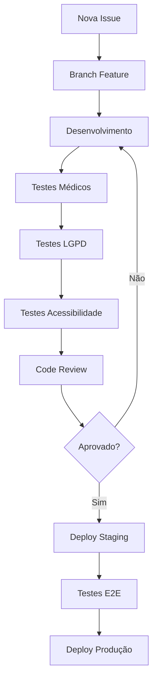

# Guia de Onboarding da Equipe - Fase 3
## Plataforma Educacional Médica sobre Hanseníase

**Versão:** 3.0.0  
**Data:** 07/09/2025  
**Objetivo:** Integração completa e eficiente de novos membros da equipe

---

## 🎯 Bem-vindo à Equipe!

Este guia foi especialmente desenvolvido para integrar novos membros da equipe ao projeto de **Plataforma Educacional Médica sobre Hanseníase**, garantindo compreensão completa dos aspectos técnicos, médicos, legais e éticos do projeto.

### 🏥 Contexto do Projeto

**O que estamos construindo:**
- Plataforma educacional para profissionais de saúde especializada em hanseníase
- Foco em farmacêuticos e médicos
- **Conformidade LGPD obrigatória** para dados de saúde
- **Acessibilidade WCAG 2.1 AA** mandatória
- **Precisão médica 99%+** em cálculos e protocolos

**Personas Educacionais:**
- **Dr. Gasnelio:** Médico experiente, necessita informações avançadas e precisas
- **GA:** Farmacêutico em aprendizado, requer orientação educacional estruturada

---

## 📋 Checklist de Onboarding (5 Dias)

### 🚀 Dia 1: Configuração e Contexto

#### Manhã (4 horas)
- [ ] **Reunião de boas-vindas com Tech Lead** (30 min)
- [ ] **Apresentação do projeto médico** (60 min)
  - História da hanseníase no Brasil
  - Impacto social e importância da educação médica
  - Protocolos do Ministério da Saúde
- [ ] **Setup do ambiente de desenvolvimento** (120 min)
- [ ] **Primeira execução e teste local** (30 min)

#### Tarde (4 horas)
- [ ] **Treinamento LGPD para dados de saúde** (90 min)
- [ ] **Workshop de acessibilidade WCAG** (90 min)
- [ ] **Conhecendo as personas Dr. Gasnelio e GA** (60 min)

#### Setup do Ambiente
```bash
# 1. Clone do repositório
git clone https://github.com/seu-usuario/hanseniase-platform.git
cd hanseniase-platform

# 2. Configuração inicial
cp .env.example .env.local
npm install

# 3. Configuração do banco local
createdb hanseniase_dev
npm run db:migrate
npm run db:seed

# 4. Primeiro teste
npm run dev
# Acessar: http://localhost:3000

# 5. Executar testes
npm test
npm run test:medical
npm run test:accessibility
```

### 🏥 Dia 2: Compreensão do Domínio Médico

#### Manhã (4 horas)
- [ ] **Estudo dos tipos de hanseníase** (PB vs MB)
- [ ] **Calculadoras médicas implementadas**
- [ ] **Protocolos de medicação (Rifampicina, Dapsona, Clofazimina)**
- [ ] **Casos clínicos das personas**

#### Tarde (4 horas)
- [ ] **Hands-on com calculadoras médicas**
- [ ] **Validação de protocolos do Ministério da Saúde**
- [ ] **Teste das funcionalidades educacionais**

#### Material de Estudo Obrigatório
```bash
# Documentação médica essencial
./docs/medical/hanseniase-overview.md
./docs/medical/medication-protocols.md
./docs/medical/calculation-formulas.md

# Casos práticos
./docs/cases/dr-gasnelio-advanced-cases.md
./docs/cases/ga-learning-scenarios.md

# Protocolos oficiais
./docs/protocols/ministerio-saude-2025.md
./docs/protocols/oms-guidelines.md
```

### 🛠️ Dia 3: Ferramentas e Workflows

#### Manhã (4 horas)
- [ ] **Slash commands (`/commit`, `/check`, `/create-docs`)**
- [ ] **Sistema de automação avançada**
- [ ] **Git hooks e validações automáticas**
- [ ] **Templates e documentação**

#### Tarde (4 horas)
- [ ] **Dashboard de monitoramento médico**
- [ ] **Sistema de notificações inteligentes**
- [ ] **Testes end-to-end e validação**

#### Prática com Ferramentas
```bash
# 1. Testar slash commands
/commit "feat: adicionar nova funcionalidade de teste"
/check --medical --lgpd --accessibility
/create-docs --component=MedicalCalculator

# 2. Executar automação
node .claude/automation/lgpd-compliance-checker.js
node .claude/automation/accessibility-validator.js

# 3. Monitoramento
npm run dashboard:start
# Acessar: http://localhost:3030

# 4. Testes avançados
npm run test:e2e
node .claude/tests/end-to-end-validation-suite.js
```

### 💻 Dia 4: Primeira Contribuição

#### Manhã (4 horas)
- [ ] **Escolher uma issue de onboarding**
- [ ] **Implementar correção/funcionalidade**
- [ ] **Executar todos os testes de qualidade**
- [ ] **Documentar mudanças**

#### Tarde (4 horas)
- [ ] **Code review com mentor**
- [ ] **Correções baseadas no feedback**
- [ ] **Merge da primeira contribuição**
- [ ] **Celebração da primeira contribuição!** 🎉

#### Issues Recomendadas para Primeira Contribuição
- Melhorar acessibilidade de formulário específico
- Adicionar teste para calculadora médica
- Corrigir pequeno bug em validação LGPD
- Melhorar documentação de função específica
- Otimizar performance de componente

### 🏆 Dia 5: Validação e Próximos Passos

#### Manhã (4 horas)
- [ ] **Quiz de validação de conhecimento**
- [ ] **Simulação de cenário de emergência**
- [ ] **Apresentação do projeto para a equipe**
- [ ] **Feedback sobre processo de onboarding**

#### Tarde (4 horas)
- [ ] **Planejamento de próximos projetos**
- [ ] **Definição de responsabilidades**
- [ ] **Configuração de alertas pessoais**
- [ ] **Reunião de finalização com gestor**

---

## 🧠 Conhecimento Essencial

### 1. Conceitos Médicos Fundamentais

#### Hanseníase - Básico
```
📚 HANSENÍASE - CONCEITOS ESSENCIAIS

🔬 Definição:
Doença infecciosa crônica causada pelo Mycobacterium leprae

📊 Classificação Operacional:
• Paucibacilar (PB): ≤ 5 lesões cutâneas
• Multibacilar (MB): > 5 lesões cutâneas

💊 Esquemas Terapêuticos (PQT):
• PB: Rifampicina + Dapsona (6 meses)
• MB: Rifampicina + Dapsona + Clofazimina (12 meses)

⚕️ Importância:
• Brasil: 2º país em número de casos no mundo
• Doença de notificação compulsória
• Cura disponível e gratuita pelo SUS
```

#### Medicações Principais
| Medicação | Dose Adulto | Frequência | Mecanismo |
|-----------|-------------|------------|-----------|
| Rifampicina | 600mg | Mensal supervisionada | Bactericida |
| Dapsona | 100mg | Diária | Bacteriostático |
| Clofazimina | 300mg + 50mg | Mensal + Diária | Bactericida |

### 2. Aspectos Técnicos Críticos

#### Conformidade LGPD (Lei 13.709/2018)
```
🛡️ LGPD PARA DADOS DE SAÚDE

📜 Base Legal:
Artigo 11 - Tratamento de dados sensíveis (saúde)

✅ Requisitos Obrigatórios:
• Consentimento específico e destacado
• Finalidade específica e explícita
• Minimização de dados coletados
• Segurança e confidencialidade
• Direitos do titular (acesso, correção, exclusão)

🔒 Medidas Técnicas:
• Criptografia em repouso e trânsito
• Logs de auditoria completos
• Controle de acesso granular
• Backup com retenção de 7 anos (dados médicos)

⚖️ Penalidades:
Até 2% do faturamento ou R$ 50 milhões
```

#### Acessibilidade WCAG 2.1 AA
```
♿ ACESSIBILIDADE - PRINCÍPIOS ESSENCIAIS

🎯 4 Princípios Fundamentais:
1. Perceptível - Informação apresentada de forma perceptível
2. Operável - Componentes navegáveis e operáveis
3. Compreensível - Informação e UI compreensíveis
4. Robusto - Conteúdo interpretável por tecnologias assistivas

🎨 Requisitos Técnicos Principais:
• Contraste mínimo 4.5:1 (texto normal)
• Navegação 100% por teclado
• Textos alternativos em imagens
• Estrutura semântica HTML
• Suporte a leitores de tela

🧪 Ferramentas de Teste:
• axe-core (automático)
• NVDA/JAWS (leitor de tela)
• Lighthouse (auditoria)
• Manual keyboard testing
```

### 3. Workflows de Desenvolvimento

#### Fluxo de Trabalho Padrão


#### Comandos Essenciais
```bash
# Desenvolvimento diário
git checkout -b feature/nova-funcionalidade
npm run dev
npm run test:watch

# Antes do commit
npm run lint:fix
npm run test:medical
npm run test:lgpd
npm run test:accessibility

# Commit com validação automática
/commit "feat: adicionar validação de dosagem para clofazimina"

# Deploy
npm run build
npm run test:e2e
npm run deploy:staging
```

---

## 📚 Recursos de Aprendizado

### 1. Documentação Técnica

#### Repositórios e Links
- **Repo Principal:** https://github.com/seu-usuario/hanseniase-platform
- **Documentação:** https://docs.hanseniase-platform.com.br
- **Wiki da Equipe:** https://wiki.interno.com.br/hanseniase

#### Arquivos Importantes
```bash
# Leitura obrigatória primeira semana
README.md                           # Visão geral do projeto
ARCHITECTURE.md                     # Arquitetura do sistema
MEDICAL_PROTOCOLS.md                # Protocolos médicos
LGPD_COMPLIANCE_GUIDE.md           # Guia de conformidade LGPD
ACCESSIBILITY_STANDARDS.md         # Padrões de acessibilidade

# Leitura recomendada segunda semana
docs/api/                          # Documentação da API
docs/components/                   # Documentação dos componentes
docs/testing/                      # Estratégias de teste
docs/deployment/                   # Processos de deploy
```

### 2. Recursos Médicos

#### Fontes Oficiais
- **Ministério da Saúde:** [Manual Técnico de Hanseníase](https://bvsms.saude.gov.br/)
- **OMS:** [WHO Guidelines on Leprosy](https://www.who.int/publications)
- **ANVISA:** [Regulamentações Farmacêuticas](https://www.gov.br/anvisa/)

#### Material de Estudo
```bash
# PDFs disponíveis na pasta docs/medical/
ministerio-saude-manual-hanseniase-2025.pdf
oms-guidelines-leprosy-2024.pdf
anvisa-medicamentos-hanseniase.pdf
casos-clinicos-dr-gasnelio.pdf
cenarios-aprendizado-ga.pdf
```

### 3. Treinamentos e Certificações

#### Obrigatórios (Primeira semana)
- [ ] **LGPD para Desenvolvedores** (2h) - Certificação interna
- [ ] **Acessibilidade Web** (3h) - Curso online com certificação
- [ ] **Noções de Hanseníase** (2h) - Treinamento médico básico

#### Recomendados (Primeiro mês)
- [ ] **Segurança em Sistemas de Saúde** (4h)
- [ ] **Testes Automatizados Avançados** (6h)
- [ ] **UX/UI para Sistemas Médicos** (4h)

---

## 👥 Equipe e Responsabilidades

### Organização da Equipe

#### Core Team
- **Tech Lead:** João Silva (joao.silva@empresa.com)
  - Arquitetura, decisões técnicas, mentoria
- **Medical Advisor:** Dr. Maria Santos (maria.santos@empresa.com)
  - Validação médica, protocolos, precisão clínica
- **LGPD Officer:** Ana Costa (ana.costa@empresa.com)
  - Compliance, auditoria, treinamentos LGPD
- **Accessibility Specialist:** Pedro Lima (pedro.lima@empresa.com)
  - WCAG, testes com usuários, tecnologias assistivas

#### Desenvolvedores
- **Senior:** Carlos Oliveira, Lucia Ferreira
- **Pleno:** Roberto Mendes, Amanda Silva
- **Junior:** [Você!], Miguel Rodrigues

#### Especialistas
- **DevOps/SRE:** Fernando Santos
- **QA:** Beatriz Almeida
- **UX/UI:** Camila Pereira

### Canais de Comunicação

#### Daily/Semanal
- **Daily Standup:** 9:00-9:15 (Segunda à Sexta)
- **Planning:** Segunda 14:00-16:00
- **Retrospectiva:** Sexta 16:00-17:00

#### Comunicação Assíncrona
- **Slack:** #hanseniase-dev (geral), #hanseniase-medical (questões médicas)
- **Teams:** Reuniões formais e apresentações
- **GitHub:** Issues, PRs, discussões técnicas

#### Emergências
- **Slack:** #hanseniase-emergencias
- **WhatsApp:** Grupo "Hanseníase - Emergência Técnica"
- **Telefone:** Lista de contatos de emergência

---

## 🎯 Metas e Expectativas

### Primeira Semana
- [ ] Ambiente de desenvolvimento 100% funcional
- [ ] Conhecimento básico de hanseníase adquirido
- [ ] Primeira contribuição (pequena) realizada
- [ ] Certificações obrigatórias concluídas

### Primeiro Mês
- [ ] Contribuições regulares para o projeto
- [ ] Participação ativa em code reviews
- [ ] Conhecimento intermediário dos workflows
- [ ] Capacidade de resolver issues independentemente

### Terceiro Mês
- [ ] Mentor de novos membros da equipe
- [ ] Contribuições significativas para funcionalidades
- [ ] Conhecimento avançado do domínio médico
- [ ] Capacidade de liderar pequenos projetos

### Indicadores de Sucesso
```
📊 MÉTRICAS DE ACOMPANHAMENTO

🎯 Semana 1-2:
• Setup concluído: ✅/❌
• Testes passando localmente: ✅/❌
• Primeira PR merged: ✅/❌

🎯 Mês 1:
• PRs abertas: N/semana
• Code reviews realizadas: N/semana
• Issues resolvidas: N/mês

🎯 Mês 3:
• Funcionalidades entregues: N
• Mentorias realizadas: N
• Apresentações técnicas: N
```

---

## 🚀 Próximos Passos Após Onboarding

### Crescimento na Carreira
1. **Especialista em Domínio Médico**
   - Aprofundar conhecimento em protocolos médicos
   - Certificação em sistemas de saúde
   - Participação em conferências médicas

2. **Especialista em Compliance**
   - Certificação LGPD avançada
   - Auditoria de sistemas de saúde
   - Consultoria em privacy by design

3. **Tech Lead Especializado**
   - Liderança de projetos médicos
   - Arquitetura de sistemas críticos
   - Mentoria técnica

### Oportunidades de Desenvolvimento
- Participação em projetos open source de saúde
- Apresentações em eventos de tecnologia médica
- Colaboração com universidades e institutos de pesquisa
- Desenvolvimento de cursos e treinamentos

---

## 📞 Suporte e Contatos

### Dúvidas Técnicas
- **Slack:** #hanseniase-dev
- **Tech Lead:** joao.silva@empresa.com
- **Senior Developers:** carlos.oliveira@empresa.com, lucia.ferreira@empresa.com

### Questões Médicas
- **Medical Advisor:** maria.santos@empresa.com
- **Canal Específico:** #hanseniase-medical

### LGPD e Compliance
- **LGPD Officer:** ana.costa@empresa.com
- **Documentação:** Portal interno de compliance

### Acessibilidade
- **Accessibility Specialist:** pedro.lima@empresa.com
- **Recursos:** Biblioteca interna de testes de acessibilidade

### RH e Administrativo
- **Gestora:** patricia.rh@empresa.com
- **Benefits:** beneficios@empresa.com

---

## 📝 Feedback e Melhoria Contínua

### Processo de Feedback
- **Feedback 360°:** Mensal
- **One-on-One:** Quinzenal com Tech Lead
- **Review de Performance:** Trimestral
- **Feedback sobre Onboarding:** Imediato após conclusão

### Como Dar Feedback sobre Este Guia
1. Abrir issue no repositório: `hanseniase-platform/issues`
2. Usar tag: `onboarding-feedback`
3. Descrever claramente sugestões de melhoria
4. Propor soluções quando possível

### Histórico de Melhorias
- **v3.0:** Adicionado sistema de inteligência de notificações
- **v2.2:** Melhorado processo de validação médica
- **v2.1:** Aprimorado treinamento LGPD
- **v2.0:** Reestruturação completa baseada em feedback

---

**Bem-vindo à equipe! Estamos animados para trabalhar com você! 🚀**

---

**Última atualização:** 07/09/2025  
**Versão do Guia:** 3.0.0  
**Próxima revisão:** 01/12/2025

> 💡 **Lembre-se:** Este é um projeto que impacta diretamente a saúde de pessoas. Cada linha de código, cada decisão técnica, cada validação que fazemos pode contribuir para melhorar o cuidado e o tratamento de pacientes com hanseníase. Isso é mais que desenvolvimento de software - é contribuição social significativa!