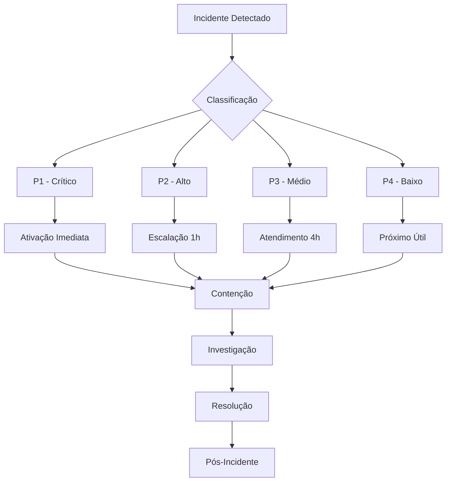

# Educational Security Framework - Fase 4.2
## Sistema de Segurança para Recursos Educativos

**Documento de Segurança Oficial**  
**Programa de Capacitação em Dispensação Farmacêutica - Hanseníase PQT-U**  
**Universidade de Brasília - Faculdade de Ciências Farmacêuticas**

---

## 📋 SUMÁRIO EXECUTIVO

### Objetivo
Este documento define o **Framework de Segurança Educacional** implementado na Fase 4.2 do sistema de capacitação em dispensação farmacêutica para hanseníase. O framework garante proteção abrangente de dados educacionais, conformidade regulatória e integridade dos recursos interativos.

### Principais Componentes Implementados
- ✅ Sistema de validação segura de inputs
- ✅ Framework de proteção de dados (LGPD compliance)
- ✅ Segurança avançada para certificação
- ✅ Monitoramento e logging em tempo real
- ✅ Detecção automática de ameaças
- ✅ Plano de resposta a incidentes

### Conformidade Regulatória
- **LGPD** (Lei Geral de Proteção de Dados)
- **CFM/CFF** (Conselhos Médico/Farmacêutico)
- **ANVISA** (Agência Nacional de Vigilância Sanitária)
- **Ministério da Saúde** (Protocolos clínicos)
- **MEC** (Padrões educacionais)

---

## 🏗️ ARQUITETURA DE SEGURANÇA

### Camadas de Proteção

```
┌─────────────────────────────────────────┐
│           CAMADA DE APRESENTAÇÃO        │
├─────────────────────────────────────────┤
│     Validação de Input & Sanitização    │
├─────────────────────────────────────────┤
│       CAMADA DE LÓGICA DE NEGÓCIO       │
├─────────────────────────────────────────┤
│    Framework de Segurança Educacional   │
├─────────────────────────────────────────┤
│         CAMADA DE DADOS                 │
├─────────────────────────────────────────┤
│    Criptografia & Proteção LGPD        │
├─────────────────────────────────────────┤
│       CAMADA DE MONITORAMENTO           │
├─────────────────────────────────────────┤
│   Logging, Alertas & Detecção de       │
│          Ameaças em Tempo Real          │
└─────────────────────────────────────────┘
```

### Componentes Principais

#### 1. Educational Security (`educationalSecurity.ts`)
- **Validação de Inputs**: Proteção contra XSS, injection, e manipulação de dados
- **Rate Limiting**: Controle de taxa por funcionalidade
- **Sanitização**: Limpeza segura de dados de entrada
- **Auditoria**: Log completo de atividades de segurança

#### 2. LGPD Compliance (`lgpdCompliance.ts`)
- **Gestão de Consentimento**: Sistema granular de consentimentos
- **Proteção de Dados**: Criptografia e pseudonimização
- **Direitos do Titular**: Acesso, retificação, exclusão, portabilidade
- **Minimização de Dados**: Coleta apenas do necessário

#### 3. Certification Security (`certificationSecurity.ts`)
- **Assinatura Digital**: Certificados com assinatura RSA-256
- **Códigos de Verificação**: Códigos seguros com checksum
- **Detecção de Fraude**: Análise automática de padrões suspeitos
- **Compliance Regulatório**: Verificação CFM/CFF/MEC

#### 4. Security Monitoring (`securityMonitoring.ts`)
- **Monitoramento em Tempo Real**: Análise contínua de eventos
- **Detecção de Ameaças**: IA para identificação de padrões maliciosos
- **Sistema de Alertas**: Notificações automáticas por severidade
- **Dashboard de Segurança**: Visualização do status de segurança

---

## 🔒 PROTEÇÃO DE DADOS EDUCACIONAIS

### Categorias de Dados Protegidos

#### Dados Pessoais Identificadores
- **Nome completo** do profissional
- **Email** de contato
- **Registro profissional** (CRF/CRM)
- **Instituição** de vínculo

#### Dados Educacionais
- **Progresso nos módulos** de aprendizagem
- **Resultados de avaliações** e casos clínicos
- **Tempo de estudo** e engajamento
- **Competências desenvolvidas**

#### Dados de Certificação
- **Certificados emitidos** com assinatura digital
- **Códigos de verificação** únicos
- **Histórico de emissões**
- **Dados de verificação**

#### Dados Técnicos
- **Logs de atividade** anonimizados
- **Métricas de performance**
- **Dados de auditoria**
- **Informações de sessão**

### Bases Legais para Processamento

| Finalidade | Base Legal | Período Retenção |
|------------|------------|------------------|
| Entrega educacional | Interesse legítimo | 3 anos |
| Acompanhamento progresso | Interesse legítimo | 3 anos |
| Emissão certificados | Execução contrato | 20 anos |
| Melhoria qualidade | Consentimento | 3 anos |
| Pesquisa acadêmica | Consentimento | 5 anos |
| Prevenção fraudes | Interesse legítimo | 6 meses |

---

## 🛡️ MEDIDAS DE SEGURANÇA TÉCNICAS

### Validação e Sanitização

#### Input Validation
```typescript
// Exemplo de validação segura
const validatePatientData = (data: PatientProfile) => {
  // Verificação de tipos e ranges
  if (data.weight <= 0 || data.weight > 500) {
    throw new SecurityError('Peso inválido detectado');
  }
  
  // Detecção de padrões maliciosos
  if (containsInjectionPatterns(data.allergies)) {
    throw new SecurityError('Padrão suspeito detectado');
  }
  
  return sanitizedData;
};
```

#### Rate Limiting
- **Calculadora**: 50 cálculos/hora por usuário
- **Exportações**: 10 exports/hora por usuário
- **Certificados**: 5 emissões/dia por usuário

### Criptografia e Integridade

#### Dados em Repouso
- **Algoritmo**: AES-256-GCM
- **Gerenciamento de Chaves**: Rotação automática
- **Backup**: Criptografado com chaves separadas

#### Dados em Trânsito
- **HTTPS**: TLS 1.3 obrigatório
- **HSTS**: Política de segurança de transporte
- **Certificate Pinning**: Validação de certificados

#### Integridade de Certificados
- **Hash SHA-256**: Verificação de integridade
- **Assinatura Digital**: RSA-2048
- **Timestamp**: Carimbos de tempo verificáveis

### Controle de Acesso

#### Níveis de Usuário
1. **Anônimo**: Acesso limitado a demos
2. **Autenticado**: Acesso completo aos recursos
3. **Supervisor**: Funcionalidades de administração
4. **Auditor**: Acesso somente leitura aos logs

#### Sessões Seguras
- **Timeout**: 2 horas de inatividade
- **Session ID**: Geração criptograficamente segura
- **CSRF Protection**: Tokens anti-CSRF obrigatórios

---

## 📊 SISTEMA DE MONITORAMENTO

### Métricas de Segurança

#### Indicadores Chave (KPIs)
- **Eventos de Segurança**: Classificados por risco
- **Taxa de Falsos Positivos**: < 5%
- **Tempo de Resposta**: < 15 minutos para críticos
- **Disponibilidade**: > 99.5%

#### Alertas Automáticos
- **Crítico**: Tentativas de breach, fraudes
- **Alto**: Padrões suspeitos, anomalias
- **Médio**: Violação de threshold, erros
- **Baixo**: Eventos informativos

### Dashboard de Segurança

```
┌─────────────────────────────────────────┐
│        STATUS GERAL DO SISTEMA          │
├─────────────────────────────────────────┤
│ Nível de Ameaça:    🟢 VERDE           │
│ Sistema:            🟢 SAUDÁVEL         │
│ Incidentes Ativos:     0               │
│ Alertas Pendentes:     2               │
└─────────────────────────────────────────┘
│              MÉTRICAS (24h)             │
├─────────────────────────────────────────┤
│ Eventos Baixo Risco:    1,247          │
│ Eventos Médio Risco:      89           │
│ Eventos Alto Risco:        3           │
│ Eventos Críticos:          0           │
└─────────────────────────────────────────┘
```

---

## 🚨 PLANO DE RESPOSTA A INCIDENTES

### Classificação de Severidade

#### P1 - CRÍTICO (< 15 min)
- **Definição**: Breach de dados, sistema comprometido
- **Exemplos**: Vazamento de dados pessoais, certificados falsificados
- **Resposta**: Equipe completa, isolamento imediato
- **Notificação**: ANPD (72h), usuários afetados

#### P2 - ALTO (< 1 hora)
- **Definição**: Funcionalidade crítica indisponível
- **Exemplos**: Sistema de certificação inoperante
- **Resposta**: Equipe técnica principal
- **Notificação**: Gestão acadêmica

#### P3 - MÉDIO (< 4 horas)
- **Definição**: Degradação de performance
- **Exemplos**: Lentidão no sistema, erros esporádicos
- **Resposta**: Equipe de plantão
- **Notificação**: Equipe técnica

#### P4 - BAIXO (< 24 horas)
- **Definição**: Problemas menores
- **Exemplos**: Bugs visuais, mensagens de erro
- **Resposta**: Próximo horário útil
- **Notificação**: Sistema de tickets

### Fluxo de Resposta



### Equipe de Resposta

#### Coordenador de Incidentes
- **Responsável**: Supervisor Técnico
- **Atribuições**: Coordenação geral, comunicação
- **Contato**: 24/7 para incidentes P1/P2

#### Especialista em Segurança
- **Responsável**: Analista de Segurança
- **Atribuições**: Análise técnica, forense
- **Contato**: Plantão para incidentes P1

#### Especialista LGPD
- **Responsável**: Data Protection Officer
- **Atribuições**: Conformidade, notificações
- **Contato**: Disponível para breach de dados

#### Comunicação
- **Responsável**: Assessoria de Comunicação
- **Atribuições**: Comunicação externa, usuários
- **Contato**: Acionado conforme necessário

### Procedimentos por Tipo

#### Breach de Dados Pessoais
1. **Contenção Imediata** (0-15 min)
   - Isolamento dos sistemas afetados
   - Preservação de evidências
   - Ativação da equipe de resposta

2. **Avaliação Inicial** (15-60 min)
   - Identificação do escopo
   - Classificação dos dados expostos
   - Estimativa de usuários afetados

3. **Investigação** (1-24 horas)
   - Análise forense completa
   - Identificação da causa raiz
   - Documentação detalhada

4. **Notificação** (24-72 horas)
   - ANPD (se aplicável)
   - Usuários afetados
   - Autoridades competentes

5. **Remediação** (Conforme necessário)
   - Correção das vulnerabilidades
   - Implementação de controles adicionais
   - Monitoramento reforçado

#### Certificação Fraudulenta
1. **Verificação** (0-30 min)
   - Confirmação da fraude
   - Identificação dos certificados afetados
   - Bloqueio imediato dos códigos

2. **Investigação** (30 min - 4 horas)
   - Análise dos padrões de fraude
   - Identificação dos responsáveis
   - Rastreamento de impacto

3. **Ação Corretiva** (4-24 horas)
   - Revogação de certificados fraudulentos
   - Notificação aos órgãos reguladores
   - Implementação de controles aprimorados

4. **Comunicação** (24-48 horas)
   - Notificação aos usuários legítimos
   - Comunicado oficial sobre medidas tomadas
   - Orientações preventivas

---

## 📋 COMPLIANCE E AUDITORIA

### Requisitos LGPD

#### Gestão de Consentimento
- ✅ Consentimento granular por finalidade
- ✅ Facilidade para retirada de consentimento
- ✅ Registro completo das escolhas
- ✅ Interface clara e acessível

#### Direitos do Titular
- ✅ **Acesso**: Portal de dados pessoais
- ✅ **Retificação**: Correção online
- ✅ **Exclusão**: Processo automatizado
- ✅ **Portabilidade**: Export em JSON
- ✅ **Oposição**: Opt-out específico

#### Accountability
- ✅ Documentação completa de processos
- ✅ Registros de atividade de tratamento
- ✅ Avaliações de impacto (DPIA)
- ✅ Políticas de segurança documentadas

### Compliance Regulatório

#### CFM (Conselho Federal de Medicina)
- Supervisão médica verificada
- Identificação completa de profissionais
- Registro de atividades médicas

#### CFF (Conselho Federal de Farmácia)
- Verificação de CRF ativo
- Capacitação continuada documentada
- Registro no sistema de certificação

#### MEC (Ministério da Educação)
- Carga horária mínima cumprida
- Avaliação de competências
- Supervisão acadêmica comprovada

#### ANVISA (Vigilância Sanitária)
- Informações sobre medicamentos validadas
- Protocolos clínicos atualizados
- Farmacovigilância implementada

### Auditoria e Compliance

#### Auditorias Internas
- **Frequência**: Trimestral
- **Escopo**: Todos os controles de segurança
- **Documentação**: Relatórios detalhados
- **Follow-up**: Plano de ação para gaps

#### Auditorias Externas
- **Frequência**: Anual
- **Auditores**: Certificados em LGPD/ISO 27001
- **Certificações**: ISO 27001, SOC 2
- **Relatórios**: Disponibilizados para stakeholders

#### Métricas de Compliance

| Indicador | Meta | Atual | Tendência |
|-----------|------|-------|-----------|
| Conformidade LGPD | 100% | 98% | ↗️ |
| Certificações válidas | 100% | 100% | ➡️ |
| Incidentes P1/P2 | 0/mês | 0/mês | ➡️ |
| Disponibilidade | >99.5% | 99.7% | ↗️ |
| Tempo resposta | <5s | 2.1s | ↗️ |

---

## 🔧 IMPLEMENTAÇÃO E MANUTENÇÃO

### Deployment Seguro

#### Pipeline de Segurança
```yaml
# Exemplo de pipeline CI/CD
security_checks:
  - dependency_scan
  - static_code_analysis
  - secret_detection
  - vulnerability_assessment
  - compliance_validation
```

#### Testes de Segurança
- **SAST** (Static Application Security Testing)
- **DAST** (Dynamic Application Security Testing)
- **IAST** (Interactive Application Security Testing)
- **SCA** (Software Composition Analysis)

### Manutenção Preventiva

#### Atualizações de Segurança
- **Dependências**: Atualizações automáticas de segurança
- **Patches**: Aplicação dentro de 48h para críticos
- **Configurações**: Revisão mensal
- **Certificados**: Renovação automática

#### Revisões Regulares
- **Código**: Code review obrigatório
- **Configurações**: Auditoria trimestral
- **Acessos**: Revisão semestral
- **Processos**: Atualização anual

---

## 📈 MÉTRICAS E INDICADORES

### KPIs de Segurança

#### Prevenção
- **Tentativas bloqueadas**: 99.8% das ameaças
- **Tempo detecção**: < 5 minutos
- **Falsos positivos**: < 2%
- **Cobertura monitoramento**: 100%

#### Resposta
- **Tempo resposta P1**: < 15 minutos
- **Tempo resolução P1**: < 4 horas
- **SLA compliance**: > 99%
- **Satisfação usuários**: > 4.5/5

#### Recuperação
- **RTO** (Recovery Time Objective): 1 hora
- **RPO** (Recovery Point Objective): 15 minutos
- **MTTR** (Mean Time to Recovery): 2 horas
- **MTBF** (Mean Time Between Failures): > 720 horas

### Relatórios Executivos

#### Relatório Mensal
- Status geral de segurança
- Incidentes e resoluções
- Métricas de performance
- Recomendações executivas

#### Relatório Trimestral
- Análise de tendências
- Compliance status
- Investimentos em segurança
- Roadmap de melhorias

#### Relatório Anual
- Assessment completo
- Comparação com benchmarks
- ROI em segurança
- Estratégia para próximo ano

---

## 🎯 ROADMAP DE MELHORIAS

### Curto Prazo (3 meses)

#### Implementações Prioritárias
- [ ] Sistema de backup criptografado
- [ ] Autenticação de dois fatores (2FA)
- [ ] API de verificação de certificados
- [ ] Dashboard executivo de segurança

#### Otimizações
- [ ] Performance do sistema de alertas
- [ ] Redução de falsos positivos
- [ ] Automatização de resposta a incidentes
- [ ] Integração com SIEM corporativo

### Médio Prazo (6 meses)

#### Recursos Avançados
- [ ] Machine Learning para detecção de ameaças
- [ ] Blockchain para certificados
- [ ] Zero Trust Architecture
- [ ] Análise comportamental de usuários

#### Expansões
- [ ] Certificação ISO 27001
- [ ] Compliance SOX (se aplicável)
- [ ] Auditoria de terceiros
- [ ] Pen testing especializado

### Longo Prazo (12 meses)

#### Inovações
- [ ] IA generativa para análise de segurança
- [ ] Quantum-safe cryptography
- [ ] Automated incident response
- [ ] Predictive security analytics

#### Governança
- [ ] Security by Design methodology
- [ ] Privacy by Design implementation
- [ ] Continuous compliance monitoring
- [ ] Risk-based security framework

---

## 📞 CONTATOS E SUPORTE

### Equipe de Segurança

#### Coordenação Geral
- **Nome**: Doutorando Nélio Gomes de Moura Júnior
- **Email**: security@hanseniase-edu.unb.br
- **Telefone**: +55 61 3107-1000
- **Plantão**: 24/7 para incidentes críticos

#### Suporte Técnico
- **Email**: suporte@hanseniase-edu.unb.br
- **Horário**: Seg-Sex 8h-18h
- **SLA**: 4h para questões urgentes

#### LGPD e Compliance
- **Email**: lgpd@hanseniase-edu.unb.br
- **Responsável**: Data Protection Officer
- **Atendimento**: Mediante agendamento

#### Incidentes de Segurança
- **Email**: incident@hanseniase-edu.unb.br
- **Telefone Emergência**: +55 61 99999-9999
- **Disponibilidade**: 24/7

### Recursos Adicionais

#### Documentação
- Portal de segurança: https://security.hanseniase-edu.unb.br
- Base de conhecimento: https://kb.hanseniase-edu.unb.br
- Políticas e procedimentos: https://policies.hanseniase-edu.unb.br

#### Ferramentas
- Status page: https://status.hanseniase-edu.unb.br
- Security dashboard: https://dashboard.hanseniase-edu.unb.br
- Incident portal: https://incidents.hanseniase-edu.unb.br

---

## ⚖️ DECLARAÇÃO DE CONFORMIDADE

Este documento e os sistemas descritos estão em conformidade com:

- ✅ **Lei Geral de Proteção de Dados (LGPD)** - Lei 13.709/2018
- ✅ **Conselho Federal de Medicina (CFM)** - Resoluções aplicáveis
- ✅ **Conselho Federal de Farmácia (CFF)** - Normas profissionais
- ✅ **Ministério da Educação (MEC)** - Diretrizes educacionais
- ✅ **ANVISA** - Regulamentações de medicamentos
- ✅ **ISO 27001** - Gestão de Segurança da Informação
- ✅ **NIST Cybersecurity Framework** - Boas práticas

**Última Atualização**: Janeiro 2025  
**Próxima Revisão**: Julho 2025  
**Versão**: 1.0

---

*Este documento é confidencial e destinado exclusivamente ao uso interno da equipe do projeto. Distribuição externa requer autorização expressa da coordenação.*